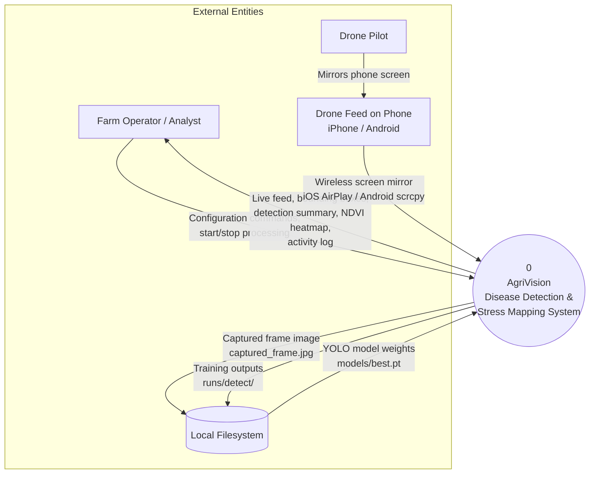
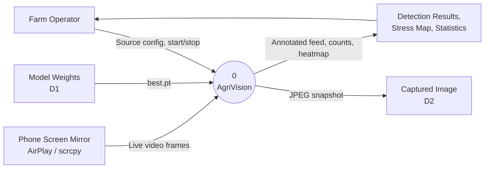
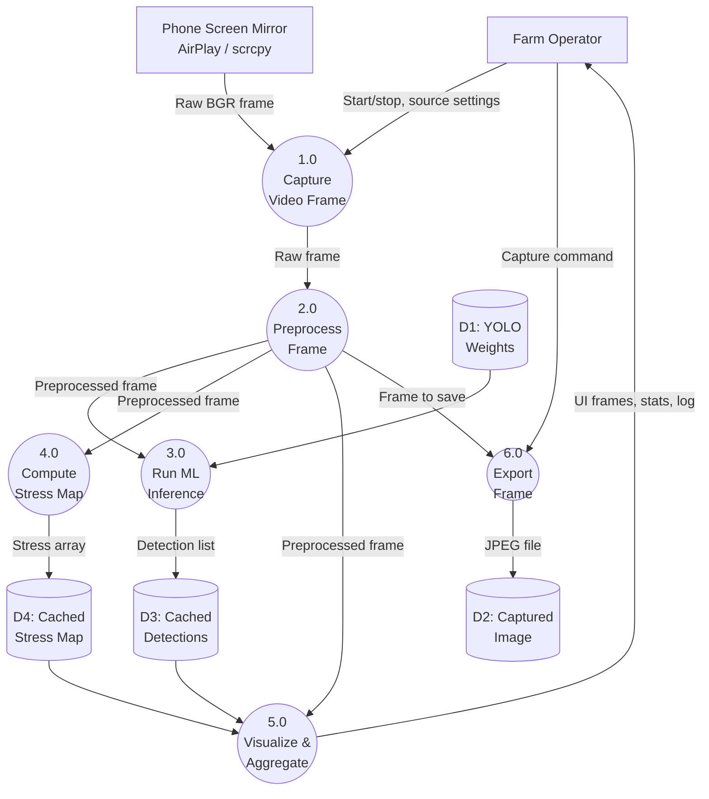
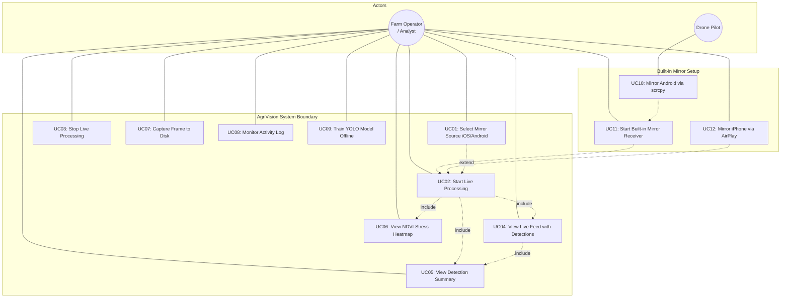
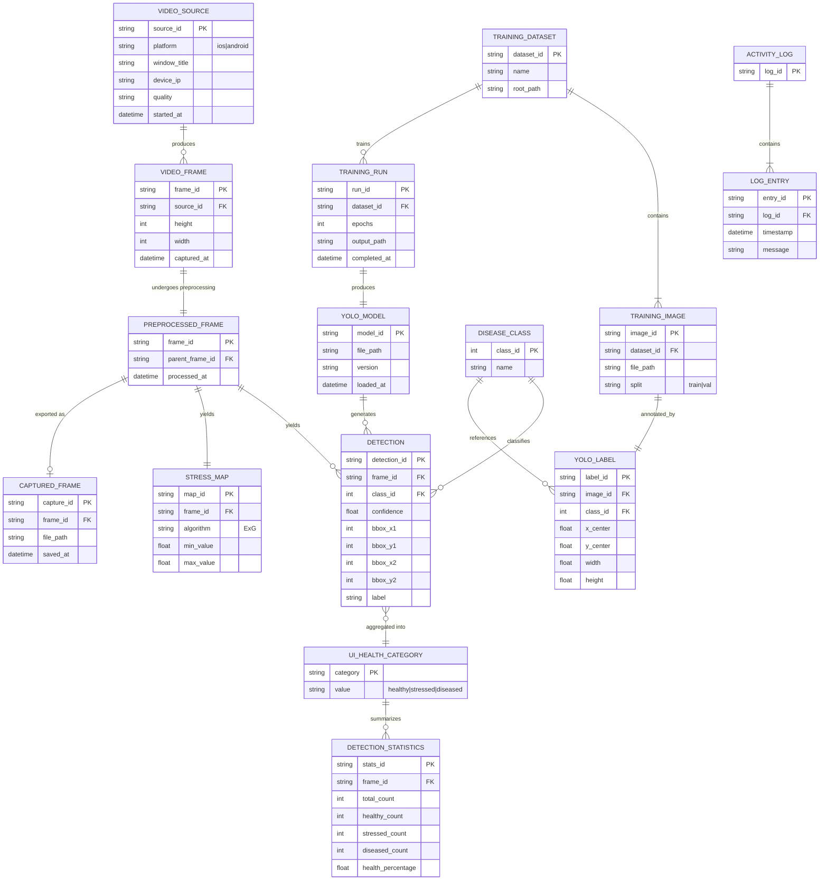

# AgriVision — Conceptual Framework

**System title:** A Drone-Based System for Detecting Banana Diseases and Mapping Crop Stress Using YOLOv8 and NDVI Image Analysis

**System type:** Desktop application (Python, PyQt5) with real-time computer vision. There is no web server, relational database, or user authentication layer.

### draw.io (diagrams.net)

Open in [draw.io](https://app.diagrams.net/) or the Draw.io desktop app. See also [`docs/diagrams/README.md`](diagrams/README.md).

**Separate files (recommended for thesis figures):**

| File | Section |
|------|---------|
| [`docs/diagrams/AgriVision-DFD.drawio`](diagrams/AgriVision-DFD.drawio) | **g.** DFD Level 0 + Level 1 (2 tabs) |
| [`docs/diagrams/AgriVision-Use-Case-Diagram.drawio`](diagrams/AgriVision-Use-Case-Diagram.drawio) | **h.** Use Case Diagram |
| [`docs/diagrams/AgriVision-ERD.drawio`](diagrams/AgriVision-ERD.drawio) | **i.** ERD (Conceptual) |

**All-in-one file (includes CFD + all above):**

[`docs/diagrams/AgriVision-Conceptual-Framework.drawio`](diagrams/AgriVision-Conceptual-Framework.drawio)

**Export for thesis/PDF:** File → Export as → PNG (300 DPI) or PDF.

---

## Overview

AgriVision ingests live drone video (via the built-in wireless phone mirror), preprocesses frames, runs YOLOv8 disease detection and ExG-based vegetation stress mapping, and presents results to a farm operator through a graphical interface.

| Layer | Description |
|-------|-------------|
| **External entities** | Farm operator, drone pilot, phone (iOS / Android), YOLO weights on disk |
| **Core processes** | Capture → Preprocess → Detect → Stress map → Visualize → Report |
| **Data persistence** | In-memory caches during runtime; optional JPEG export and offline training files |

---

## g. Context Flow Diagram (CFD) and Data Flow Diagram (DFD)

### g.1 Context Flow Diagram (CFD) — Level 0

The CFD shows AgriVision as a single process at the center of its environment.

**CFD narrative**

| # | Entity | Interaction |
|---|--------|-------------|
| 1 | Farm Operator | Selects the mirror source (iOS / Android), starts/stops the feed, views detections and stress maps, captures frames |
| 2 | Drone Pilot | Mirrors the phone screen (showing the live drone feed) to AgriVision |
| 3 | Phone (iOS / Android) | Supplies the live screen via the built-in wireless mirror — AirPlay for iOS, scrcpy for Android — captured directly inside AgriVision |
| 4 | Local Filesystem | Stores model weights, captured snapshots, and offline training artifacts |

---

### g.2 Data Flow Diagram (DFD) — Level 0

**Level 0 data stores**

| ID | Name | Description |
|----|------|-------------|
| D1 | Model Weights | YOLOv8 `.pt` file (`models/best.pt`) |
| D2 | Captured Frame | `captured_frame.jpg` written on demand |

---

### g.3 Data Flow Diagram (DFD) — Level 1

Decomposition of Process **0** into sub-processes aligned with the application modules.

**Level 1 process specifications**

| Process | Name | Module | Input | Output |
|---------|------|--------|-------|--------|
| 1.0 | Capture Video Frame | `utils/screen_capture.py`, `utils/cast_manager.py` | Mirror window (iOS/Android) | Raw BGR `numpy` frame |
| 2.0 | Preprocess Frame | `core/preprocess.py` | Raw frame | Denoised, CLAHE-enhanced, aligned, resized frame |
| 3.0 | Run ML Inference | `core/detection.py`, `ui/inference_worker.py` | Preprocessed frame + weights | Bounding boxes, confidence, class labels |
| 4.0 | Compute Stress Map | `core/ndvi.py`, `core/processor.py` | Preprocessed frame | ExG-derived normalized stress map |
| 5.0 | Visualize & Aggregate | `utils/drawing.py`, `ui/main_window.py`, `ui/components/sidebar.py` | Frame, detections, stress map | Overlaid feed, Healthy/Stressed/Diseased counts, NDVI heatmap, activity log |
| 6.0 | Export Frame | `ui/main_window.py` | Preprocessed frame | `captured_frame.jpg` |

**Data dictionary (key flows)**

| Data flow | Composition |
|-----------|-------------|
| Raw BGR frame | `H × W × 3` uint8 array from OpenCV |
| Preprocessed frame | Same shape after denoise, CLAHE, temporal alignment, resize |
| Detection list | `[{bbox, confidence, class, label}, ...]` |
| Stress map | `H × W` float array (ExG index) |
| Detection statistics | `{total, healthy, stressed, diseased}` aggregated from YOLO labels |

---

## h. Use Case Diagram

### Use case descriptions

| ID | Use case | Actor | Description | Preconditions | Postconditions |
|----|----------|-------|-------------|---------------|----------------|
| UC01 | Select Mirror Source | Farm Operator | Choose iOS (AirPlay) or Android (scrcpy); set device IP / window title and quality | AgriVision launched | Source mode stored in UI |
| UC02 | Start Live Processing | Farm Operator | Enable capture timer and background inference worker | Video source available | Live feed updating with overlays |
| UC03 | Stop Live Processing | Farm Operator | Stop timer and release capture handles | Processing active | Feed frozen; resources released |
| UC04 | View Live Feed with Detections | Farm Operator | See video with bounding boxes (Healthy / Stressed / Diseased colors) | UC02 active | Real-time visual feedback |
| UC05 | View Detection Summary | Farm Operator | Sidebar shows total detections and health breakdown bar | Detections returned | Counts refreshed each frame cycle |
| UC06 | View NDVI Stress Heatmap | Farm Operator | Sidebar shows JET colormap of ExG stress index | Stress map computed | Heatmap preview updated |
| UC07 | Capture Frame to Disk | Farm Operator | Save current preprocessed frame as JPEG | Frame available | `captured_frame.jpg` written |
| UC08 | Monitor Activity Log | Farm Operator | Read timestamped log in sidebar | Any operation | Log entry appended |
| UC09 | Train YOLO Model Offline | Farm Operator | Run `train.py` to prepare dataset and fine-tune YOLOv8 | Labeled images in `datasets/` | New weights under `runs/detect/` |
| UC10 | Mirror Android via scrcpy | Drone Pilot | Connect the Android phone over USB or Wi-Fi (Wireless debugging); AgriVision launches scrcpy | Phone debugging enabled | Low-latency Android mirror window available |
| UC11 | Start Built-in Mirror Receiver | Farm Operator | Click "Start Mirror" — AgriVision auto-launches and manages the receiver (scrcpy / AirPlay) | scrcpy / AirPlay receiver installed | Mirror receiver running, feed targeted |
| UC12 | Mirror iPhone via AirPlay | Farm Operator | Use iOS Control Center → Screen Mirroring to the built-in AirPlay receiver | AirPlay receiver running | Capturable iPhone window available |

**Authentication:** Not applicable. The system runs locally with a single operator and no login module.

---

## i. Entity-Relationship Diagram (ERD)

> **Updated clean ERD:** See **[docs/ERD.md](ERD.md)** for the presentable thesis version and **[diagrams/AgriVision-ERD.drawio](diagrams/AgriVision-ERD.drawio)** for export to PNG/PDF.

AgriVision does **not** use a relational database at runtime. The ERD below is a **conceptual (logical) model** of domain entities, in-memory structures, and file-based artifacts. It is suitable for documentation and for a future persistence layer if one is added.

### Entity reference

| Entity | Role in system | Persistence |
|--------|------------------|-------------|
| **VIDEO_SOURCE** | Built-in mirror configuration (iOS AirPlay / Android scrcpy) | UI state (transient) |
| **VIDEO_FRAME** | Single captured frame from source | Memory (per tick) |
| **PREPROCESSED_FRAME** | Frame after denoise, CLAHE, alignment | Memory |
| **YOLO_MODEL** | Trained weights for inference | `models/best.pt` |
| **DISEASE_CLASS** | ML taxonomy: black_sigatoka, healthy, moko, panama | `datasets/yolo_banana/data.yaml` |
| **DETECTION** | One YOLO bounding box result | `_cached_dets` in memory |
| **UI_HEALTH_CATEGORY** | Three-tier rollup: Healthy, Stressed, Diseased | `utils/drawing.py` mapping rules |
| **DETECTION_STATISTICS** | Sidebar counts and health bar | UI labels (transient) |
| **STRESS_MAP** | ExG-derived vegetation stress grid | `_last_stress` in memory |
| **CAPTURED_FRAME** | Operator-saved snapshot | `captured_frame.jpg` |
| **TRAINING_DATASET / TRAINING_IMAGE / YOLO_LABEL** | Offline supervised learning data | `datasets/` folder tree |
| **TRAINING_RUN** | Ultralytics training output | `runs/detect/` |
| **ACTIVITY_LOG / LOG_ENTRY** | Timestamped operational messages | `Sidebar.log_box` (transient) |

### Disease class reference (from `data.yaml`)

| class_id | name | Typical UI category |
|----------|------|---------------------|
| 0 | black_sigatoka | Stressed |
| 1 | healthy | Healthy |
| 2 | moko | Diseased |
| 3 | panama | Diseased |

Label-to-category mapping also considers substring rules in `utils/drawing.py` (e.g., sigatoka → Stressed, panama → Diseased).

---

## Relationship to IPO / System Architecture

| Conceptual artifact | Maps to |
|--------------------|---------|
| CFD external entities | Operators, phone (iOS/Android mirror), filesystem |
| DFD Process 3.0 | YOLOv8 inference (`core/detection.py`) |
| DFD Process 4.0 | ExG / NDVI proxy (`core/ndvi.py`) |
| Use cases UC02–UC06 | Main window timer loop (`ui/main_window.py`) |
| ERD DETECTION + DISEASE_CLASS | YOLO output + `data.yaml` classes |

---

## Files referenced

| Component | Path |
|-----------|------|
| Application entry | `main.py` |
| Main orchestration | `ui/main_window.py` |
| Inference worker | `ui/inference_worker.py` |
| Detection | `core/detection.py` |
| Stress / ExG | `core/ndvi.py` |
| Preprocessing | `core/preprocess.py` |
| Drawing / categories | `utils/drawing.py` |
| Built-in mirror manager | `utils/cast_manager.py` |
| Screen capture | `utils/screen_capture.py` |
| Class definitions | `datasets/yolo_banana/data.yaml` |
| Training | `train.py` |

---

*Document version: 1.0 — aligned with AgriVision codebase structure.*
