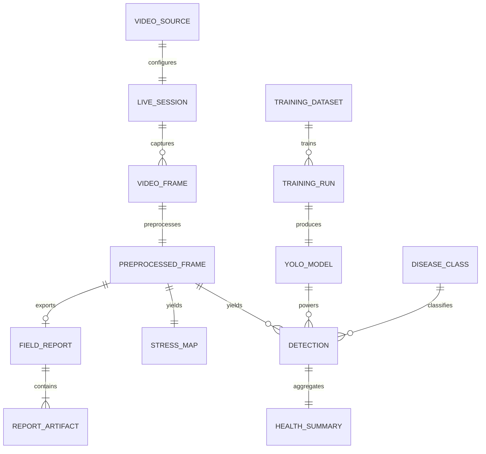
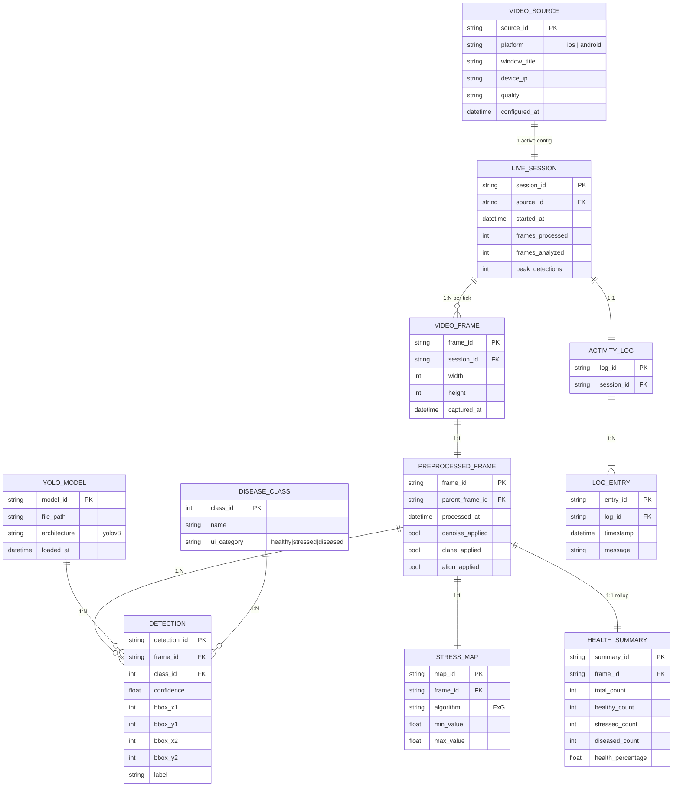
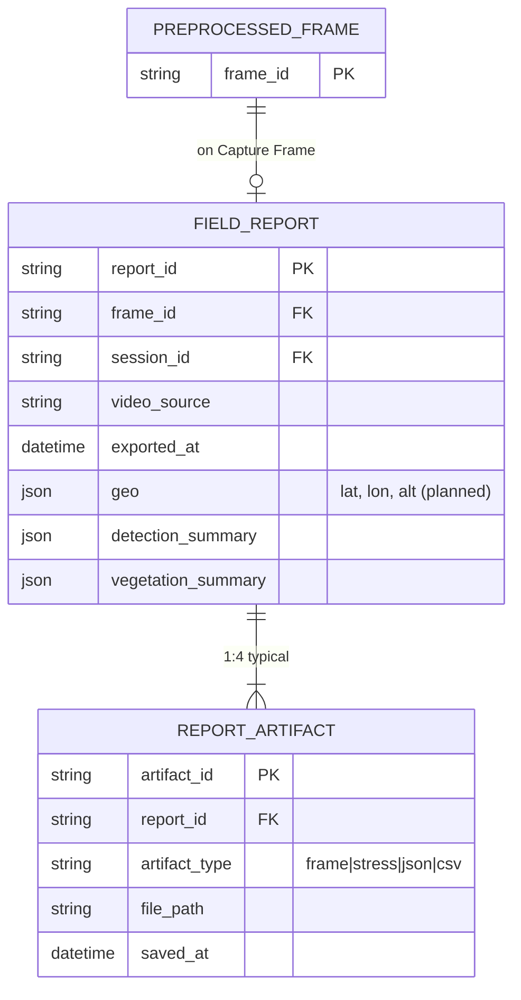
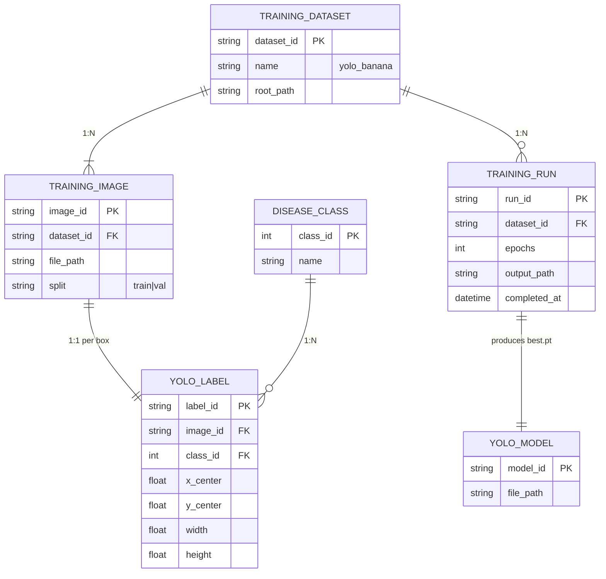

# AgriVision — Entity-Relationship Diagram (ERD)

**System:** Drone-Based Banana Disease Detection and Crop Stress Mapping  
**Model type:** Conceptual / logical ERD (no relational DB at runtime)  
**Persistence:** In-memory during live runs + file exports under `output/reports/`

---

## 1. Overview (high level)

This simplified view is suitable for **outline defense slides** and thesis chapter introductions.

| # | Entity | One-line role |
|---|--------|----------------|
| 1 | **VIDEO_SOURCE** | Built-in mirror (iOS AirPlay / Android scrcpy) |
| 2 | **LIVE_SESSION** | Rolling stats for one Start→Stop run |
| 3 | **VIDEO_FRAME** | Raw BGR frame from capture |
| 4 | **PREPROCESSED_FRAME** | Denoised, CLAHE, aligned frame |
| 5 | **YOLO_MODEL** | `models/best.pt` weights |
| 6 | **DISEASE_CLASS** | Banana disease taxonomy |
| 7 | **DETECTION** | One bounding box from YOLO |
| 8 | **STRESS_MAP** | ExG vegetation stress grid |
| 9 | **HEALTH_SUMMARY** | Healthy / Stressed / Diseased counts |
| 10 | **FIELD_REPORT** | Export bundle on Capture Frame |
| 11 | **REPORT_ARTIFACT** | JPG, PNG, JSON, CSV files |
| 12 | **TRAINING_DATASET** | Offline labeled images |
| 13 | **TRAINING_RUN** | Ultralytics training job |

---

## 2. Detailed ERD — Live processing

---

## 3. Detailed ERD — Reports & export

**Export paths (implemented):**

| artifact_type | Example path |
|---------------|--------------|
| frame | `output/reports/agrivision_YYYYMMDD_HHMMSS_frame.jpg` |
| stress | `output/reports/agrivision_YYYYMMDD_HHMMSS_stress.png` |
| json | `output/reports/agrivision_YYYYMMDD_HHMMSS_report.json` |
| csv | `output/reports/agrivision_YYYYMMDD_HHMMSS_report.csv` |

---

## 4. Detailed ERD — Offline training

### Disease classes (`datasets/yolo_banana/data.yaml`)

| class_id | name | UI category |
|----------|------|-------------|
| 0 | black_sigatoka | Stressed |
| 1 | healthy | Healthy |
| 2 | moko | Diseased |
| 3 | panama | Diseased |

---

## 5. Color legend (draw.io / thesis figures)

| Color | Domain | Entities |
|-------|--------|----------|
| Blue | Input & capture | VIDEO_SOURCE, LIVE_SESSION, VIDEO_FRAME, PREPROCESSED_FRAME |
| Green | Analysis | DETECTION, STRESS_MAP, HEALTH_SUMMARY |
| Yellow | Reference data | DISEASE_CLASS, YOLO_MODEL |
| Red / coral | UI & logging | ACTIVITY_LOG, LOG_ENTRY |
| Orange | Export | FIELD_REPORT, REPORT_ARTIFACT |
| Purple | Offline training | TRAINING_DATASET, TRAINING_IMAGE, YOLO_LABEL, TRAINING_RUN |

---

## 6. Code mapping

| Entity | Implementation |
|--------|----------------|
| VIDEO_SOURCE | `ui/components/sidebar.py` |
| LIVE_SESSION | `backend/session.py` → `SessionRecorder` |
| VIDEO_FRAME | `utils/screen_capture.py`, `utils/cast_manager.py` |
| PREPROCESSED_FRAME | `core/preprocess.py` → `FramePreprocessor` |
| YOLO_MODEL | `core/detection.py` → `models/best.pt` |
| DETECTION | `core/detection.py`, `ui/inference_worker.py` |
| STRESS_MAP | `core/ndvi.py`, `core/processor.py` |
| HEALTH_SUMMARY | `utils/drawing.py`, `ui/components/sidebar.py` |
| FIELD_REPORT | `backend/report.py` → `export_field_report()` |
| ACTIVITY_LOG | `ui/components/sidebar.py` → `log_box` |
| TRAINING_* | `train.py`, `datasets/` |

---

## 7. Export for thesis

**Draw.io (recommended for Word/PDF):**  
Open [`diagrams/AgriVision-ERD.drawio`](diagrams/AgriVision-ERD.drawio) → **File → Export as → PNG (300 DPI)**.

**Mermaid (Markdown / GitHub):**  
Use the diagrams in this file directly, or paste into [mermaid.live](https://mermaid.live).

---

## 8. Notes for panel Q&A

1. **No SQL database** — the ERD documents *logical* entities; runtime data lives in memory and flat files.
2. **LIVE_SESSION** maps to `SessionRecorder` and is included in JSON reports.
3. **STRESS_MAP** uses ExG (RGB proxy); true multispectral NDVI is a planned extension (`geo` block in reports is reserved).
4. **HEALTH_SUMMARY** replaces the older split between `UI_HEALTH_CATEGORY` and `DETECTION_STATISTICS` for a cleaner model.
