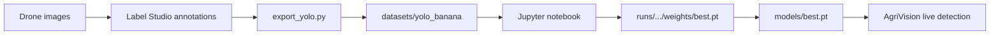

# AgriVision — Model Training (Jupyter Notebook)

This guide documents how to fine-tune the **YOLOv8 detection model** used by live AgriVision inference (`core/detection.py` → `models/best.pt`).

Training is done interactively in Jupyter. The same logic lives in `train.py` if you prefer the command line.

---

## Overview



| Stage | Tool | Output |
|-------|------|--------|
| Label | Label Studio | JSON export |
| Convert | `tools/label_studio/export_yolo.py` | YOLO folder + `data.yaml` |
| Train | `notebooks/train_banana_yolo.ipynb` | `runs/detect/.../weights/best.pt` |
| Deploy | Copy in notebook or `train.py` | `models/best.pt` |

---

## Prerequisites

1. **Python 3.10+** with a GPU recommended (CUDA). CPU training works but is slow.
2. **Repository root** as the working directory for all commands and notebook cells.
3. **Dependencies** (from repo root):

```powershell
pip install -r requirements.txt
pip install jupyter matplotlib pandas
```

4. **Base weights** — Ultralytics downloads `yolov8n.pt` on first use, or place it in the repo root.
5. **Labeled data** — bounding boxes in Label Studio for banana disease classes.

### Disease classes (detection)

The export script maps Label Studio rectangle labels to these class IDs:

| ID | Label |
|----|-------|
| 0 | `black_sigatoka` |
| 1 | `healthy` |
| 2 | `moko` |
| 3 | `panama` |

Your `datasets/yolo_banana/data.yaml` lists the classes present in the exported dataset. Class names must match what you used in Label Studio (case-insensitive).

---

## Step 1 — Annotate images in Label Studio

1. Import drone images (Local Files on Windows is supported).
2. Draw **rectangle** labels for each visible disease region or healthy plant.
3. When finished, export **JSON** (not the built-in YOLO export on Windows Local Files — that path is unreliable).

---

## Step 2 — Export to YOLO format

From the repo root (PowerShell):

```powershell
python tools/label_studio/export_yolo.py `
  --json path\to\export.json `
  --local-files-root "C:\path\to\your\images" `
  --output datasets/yolo_banana
```

Or pull directly from a running Label Studio instance:

```powershell
python tools/label_studio/export_yolo.py `
  --project-id 1 `
  --url http://localhost:8080 `
  --api-key YOUR_LEGACY_TOKEN `
  --local-files-root datasets\inbox `
  --output datasets/yolo_banana
```

### Expected dataset layout

```
datasets/yolo_banana/
  data.yaml
  images/train/    # .jpg images
  images/val/
  labels/train/    # .txt per image (class cx cy w h, normalized 0–1)
  labels/val/
```

Each label file has one line per box, for example:

```
0 0.512000 0.438000 0.220000 0.180000
```

---

## Step 3 — Start Jupyter

From the repo root:

```powershell
jupyter notebook notebooks/train_banana_yolo.ipynb
```

Or with JupyterLab:

```powershell
jupyter lab notebooks/train_banana_yolo.ipynb
```

The notebook sets `ROOT` to the project directory automatically so paths work regardless of where Jupyter was launched.

---

## Step 4 — Run the training notebook

Open [`notebooks/train_banana_yolo.ipynb`](../notebooks/train_banana_yolo.ipynb) and run cells top to bottom.

### What each section does

| Section | Purpose |
|---------|---------|
| **1. Environment** | Confirms GPU, Ultralytics version, project paths |
| **2. Dataset check** | Verifies `data.yaml`, image/label counts, shows sample image + boxes |
| **3. Train** | Loads `yolov8n.pt`, calls `model.train(...)`, writes metrics to `runs/` |
| **4. Results** | Keras-style **model accuracy** + **model loss** charts (train vs valid), plus Ultralytics plots |
| **5. Validate** | Runs `model.val()` on the val split |
| **6. Deploy** | Copies `best.pt` → `models/best.pt` for the desktop app |
| **7. Smoke test** | Runs inference on one val image |

### Recommended hyperparameters

These match a successful local run (`runs/detect/runs/banana_disease/args.yaml`):

| Parameter | Value | Notes |
|-----------|-------|-------|
| `epochs` | 50–80 | More epochs if val mAP still improving |
| `imgsz` | 640 | Match drone resolution when GPU memory allows |
| `batch` | 16 | Lower to 8 or 4 if CUDA OOM |
| `device` | `0` | Use `"cpu"` without GPU |
| `workers` | `0` | Required on Windows (multiprocessing dataloader issues) |
| Base model | `yolov8n.pt` | Nano — fast for real-time mirror inference |

Adjust in the **Train** cell of the notebook.

---

## Step 5 — Deploy weights to AgriVision

After training, the notebook copies:

```
runs/detect/<project>/<name>/weights/best.pt  →  models/best.pt
```

`core/detection.py` loads `models/best.pt` at startup. Restart the AgriVision app to pick up new weights.

If `models/best.pt` is missing, the app falls back to generic `yolov8n.pt` (not banana-specific).

---

## Step 6 — Verify in the app

1. Run `python main.py`.
2. Start the mirror feed and enable detection.
3. Confirm bounding boxes use your class names (`black_sigatoka`, `healthy`, etc.).

Optional: run the project smoke test:

```powershell
python smoke_test.py
```

---

## Command-line alternative

The notebook mirrors `train.py`. Equivalent one-liner:

```powershell
python train.py --epochs 80 --imgsz 640 --batch 16 --device 0
```

`train.py` also copies `best.pt` to `models/best.pt` when finished.

### Resume interrupted training

```powershell
python train.py --resume runs/detect/runs/banana_disease/weights/last.pt
```

In the notebook, set `RESUME = "runs/detect/runs/banana_disease/weights/last.pt"` before the train cell.

---

## Segmentation and classification (optional)

AgriVision also supports other YOLO tasks not covered by the main detection notebook:

| Task | Script | Weights path |
|------|--------|--------------|
| Instance segmentation | `train_seg.py` | `models/banana-seg.pt` |
| Image classification | Ultralytics `yolov8n-cls.pt` | `models/banana-cls.pt` |

Use the same dataset-export pattern; segmentation needs polygon/mask labels instead of rectangles.

---

## Troubleshooting

| Problem | Fix |
|---------|-----|
| `Missing dataset: data.yaml` | Run `export_yolo.py` first (Step 2) |
| CUDA out of memory | Lower `batch` (8 → 4) or `imgsz` (640 → 512) |
| `workers` crash on Windows | Keep `workers=0` |
| Empty `labels/*.txt` | Re-check Label Studio export; boxes must use rectangle labels |
| Class not detected | Label spelling must match `CLASS_NAMES` in `export_yolo.py` |
| Old weights still used | Restart AgriVision after copying `models/best.pt` |
| Training very slow on CPU | Reduce `epochs`, use `yolov8n.pt`, smaller `imgsz` |

---

## Output artifacts

After a run you will have:

```
runs/detect/runs/banana_disease/
  weights/best.pt      # best validation mAP
  weights/last.pt      # last epoch (for resume)
  results.png          # training curves
  confusion_matrix.png
  val_batch*.jpg       # prediction samples
```

Keep `best.pt` under version control only if size permits; otherwise document the run hyperparameters and store weights separately.
