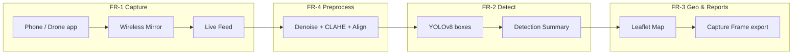

# Navigating the System — Presentation Flow

Use this guide for **outline defense**, **system demo**, or **thesis panel** when presenting how AgriVision satisfies the **Functional Requirements** in [REQUIREMENTS.md](REQUIREMENTS.md).

**Suggested demo time:** 5–7 minutes live + 1 minute training pipeline (optional slide).

**Before you present:**
```powershell
python main.py
```
Have Android phone with drone app ready (or a pre-recorded mirror window). Confirm `models/best.pt` exists.

---

## 1. System map (one slide)



| Screen area | What it does | Requirement |
|-------------|--------------|-------------|
| **Header** | AgriVision title, Drone Connected / Processing status | NFR-1 Usability |
| **Live Feed** (center) | Mirror video + bounding boxes + FPS | FR-1, FR-2 |
| **Video Source** (sidebar) | Start/Stop mirror, phone IP, quality | FR-1, NFR-3 Android |
| **Detection Summary** | Total, Healthy, Stressed, Diseased counts | FR-2 |
| **Vegetation Health** | Healthy / Moderate / High Stress pills | FR-4 |
| **Geo Tag (GPS)** | Lat/Lon, Detect My Location | FR-3 |
| **Field Map (Leaflet)** | Geo-tagged markers, Open in Browser | FR-3 |
| **Activity Log** | Timestamped events | NFR-4 Reliability |
| **▶ Start / Capture Frame** (feed footer) | Begin analysis / export report | FR-2, FR-3 |

---

## 2. Presentation script (follow in order)

### Opening (30 seconds)

> “AgriVision is a Windows desktop system for banana disease detection from aerial video. The operator uses **one dashboard** — no command line during field use. I will walk through each **functional requirement** by navigating the live application.”

Point to header: **Drone Connected** and **Processing** indicators.

---

### FR-1 — Capture aerial images from wireless mirror

**Where:** Sidebar → **Video Source**

**Say:**
> “Functional Requirement 1: the system captures aerial input through a **wireless phone mirror**. The farmer or technician mirrors the drone controller or phone screen — we use **scrcpy** on Android over USB or Wi-Fi.”

**Do:**
1. Connect the phone to your **laptop hotspot** — AgriVision auto-fills **Phone IP**, or click **Detect Phone**.
2. Leave IP blank for **USB cable** instead.
3. Select **mirror quality** (High / Balanced / etc.).
4. Click **Start Mirror**.
5. Wait for Activity Log: mirror started; scrcpy window opens (may be hidden).

**Say:**
> “Frames are pulled from the mirror window in real time. The header **Drone Connected** turns active when video is live.”

6. Click **▶ Start** on the Live Feed panel.

**Say:**
> “This begins the capture and analysis session. FPS appears on the feed badge — **Real-time Processing**.”

**If panel asks:** Wireless uses laptop hotspot auto-detect; USB works with IP left blank (NFR-3).

---

### FR-4 (part 1) — Preprocess & vegetation stress

**Where:** Live Feed (automatic) + Sidebar → **Vegetation Health**

**Say:**
> “Functional Requirement 4 includes **preprocessing** — resize, bilateral denoise, CLAHE contrast, and temporal alignment — before YOLO runs. This happens in the background; the operator only sees a stable feed.”

**Point to:**
- Live video with subtle grid overlay (preprocessing / quality path active).
- **Vegetation Health** mini pills: *Healthy*, *Moderate*, *High Stress* (ExG-based proxy).

**Say:**
> “Vegetation stress is shown as a **health index proxy** so stakeholders see crop condition beyond disease boxes alone.”

---

### FR-2 — Disease detection & classification

**Where:** Live Feed overlays + Sidebar → **Detection Summary**

**Say:**
> “Functional Requirement 2: **YOLOv8** detects Black Sigatoka, Bunchy Top, Panama disease, and healthy plants. Custom weights load from `models/best.pt`.”

**Point to:**
- Colored **bounding boxes** and labels on live feed.
- **Detection Summary:** Total Detections, Healthy, Stressed, Diseased.

**Say:**
> “Each box has a **confidence score**. Low-confidence and tiny boxes are filtered automatically. Counts update every analyzed frame.”

**Optional backup (no live drone):**
> “Model performance is reported with **precision, recall, mAP, and F1** — see Table 7 in our testing documentation.”

Open `docs/TESTING_RESULTS.md` or `output/tables/table7_yolov8n_results.md` if live feed has no plants visible.

---

### FR-3 — Geo-tagged maps & field reports

**Where:** Sidebar → **Geo Tag (GPS)** → **Field Map (Leaflet)** → **Capture Frame**

**Say:**
> “Functional Requirement 3: detections are tied to **field location** for farmers and stakeholders.”

**Do:**
1. Show **Latitude / Longitude** (auto-detected or manual plantation anchor).
2. Click **Detect My Location** if needed.
3. Point to **Field Map** — markers colored by health category.
4. Click **Open Map in Browser** → full Leaflet map with detection pins.

**Say:**
> “For a formal record, the operator clicks **Capture Frame**.”

5. Click **Capture Frame** (feed footer).

**Say:**
> “The system exports a **field report bundle** under `output/reports/`:
> - annotated frame JPG  
> - JSON and CSV summaries  
> - interactive HTML map  
> All files share one timestamp prefix.”

**Do:** Open `output/reports/` and show latest `agrivision_*_report.json` and `*_map.html`.

---

### FR-4 (part 2) — Model retraining (offline workflow)

**Where:** Terminal / documentation (not live UI button)

**Say:**
> “Requirement 4 also covers **retraining** when new drone images are labeled. This is an offline workflow for technicians, not the farmer.”

**Show slide or quick terminal:**

```powershell
# 1. Export labels from Label Studio
python tools/label_studio/export_yolo.py --json export.json --output datasets/yolo_banana

# 2. Merge new zip exports + 80-10-10 split
python tools/merge_yolo_export.py --zip new_export.zip
python tools/split_yolo_dataset.py

# 3. Train and deploy
python train.py --epochs 100 --device 0

# 4. Metrics + Keras-style graphs
python tools/generate_epoch_reports.py --epochs 20 40 60 100
```

**Say:**
> “New weights deploy to `models/best.pt`; restart AgriVision to load them.”

---

### Closing (30 seconds)

**Say:**
> “In summary: **FR-1** mirror capture, **FR-2** live YOLO detection, **FR-3** geo maps and export, **FR-4** preprocessing, stress index, and retraining pipeline. The system runs **offline** for inference and export; only map tiles need internet. Reliability is verified with `python smoke_test.py`.”

Optional:
```powershell
python -m backend
```
Show objective completion percentages.

---

## 3. Step-by-step navigation checklist

Use this as a printed cheat sheet during defense.

| Step | Action | UI element | FR |
|------|--------|------------|-----|
| 1 | Launch app | `python main.py` | — |
| 2 | Start mirror | **Start Mirror** | FR-1 |
| 3 | Start analysis | **▶ Start** | FR-1, FR-2 |
| 4 | Confirm status | Header dots + FPS badge | NFR-1 |
| 5 | Show detections | Boxes on feed + Detection Summary | FR-2 |
| 6 | Show stress | Vegetation Health pills | FR-4 |
| 7 | Set / detect GPS | Geo Tag card | FR-3 |
| 8 | Show map | Field Map + **Open Map in Browser** | FR-3 |
| 9 | Export report | **Capture Frame** | FR-3 |
| 10 | Open artifacts | `output/reports/` folder | FR-3 |
| 11 | (Optional) Stop | **Stop** mirror / session | — |

---

## 4. Requirement traceability (for panel Q&A)

| Functional requirement | What to show live | Backend module |
|------------------------|-------------------|----------------|
| **FR-1** Aerial capture via mirror | Start Mirror → Live Feed | `utils/cast_manager.py`, `utils/screen_capture.py` |
| **FR-2** Disease detect & classify | Bounding boxes + Detection Summary | `core/detection.py`, `ui/inference_worker.py` |
| **FR-3** Geo reports & summaries | GPS + Leaflet map + Capture Frame | `backend/geo.py`, `backend/report.py`, `backend/map_export.py` |
| **FR-4** Preprocess, stress, retrain | Stable feed + Vegetation Health; train.py slide | `core/preprocess.py`, `core/ndvi.py`, `train.py` |

| Non-functional requirement | What to mention |
|----------------------------|-----------------|
| **NFR-1** Easy to use | Single dashboard, no CLI for operator |
| **NFR-2** Offline capable | Inference + export work offline; maps need internet for tiles |
| **NFR-3** Windows + Android | PyQt5 on Windows; scrcpy for Android mirror |
| **NFR-4** Reliable | `smoke_test.py`, Activity Log, modular pipeline |

---

## 5. Troubleshooting during live demo

| Problem | Quick fix | What to say |
|---------|-----------|-------------|
| Mirror won't start | USB debugging on; same Wi-Fi; run `adb devices` | “Mirror requires phone authorization once.” |
| Black feed | Click **Start** after mirror; wait 2–3 s | “Feed waits for live video, not a static screen.” |
| No detections | Point camera at plants; lower light OK | “Model needs visible canopy; metrics are in Table 7.” |
| Map empty | Set Lat/Lon; run detections first | “Map markers appear after analyzed frames with GPS anchor.” |
| Export missing | Click **Capture Frame** while feed running | “Export is operator-triggered per field snapshot.” |

---

## 6. One-minute defense version (compressed)

1. **Start Mirror** → **▶ Start** → “FR-1 capture.”  
2. Point at boxes → “FR-2 YOLOv8, four classes.”  
3. Point at map + GPS → “FR-3 geo-tagged monitoring.”  
4. **Capture Frame** → open JSON/CSV/HTML → “FR-3 stakeholder reports.”  
5. Mention preprocess + stress + `train.py` → “FR-4 improvement loop.”

---

## 7. Related documents

| Document | Use when |
|----------|----------|
| [REQUIREMENTS.md](REQUIREMENTS.md) | FR/NFR wording |
| [TESTING_RESULTS.md](TESTING_RESULTS.md) | Table 7 metrics, graphs |
| [OUTLINE_DEFENSE_STATUS.md](OUTLINE_DEFENSE_STATUS.md) | Completion % |
| [DATA_DICTIONARY.md](DATA_DICTIONARY.md) | Export JSON/CSV fields |
| [MODEL_TRAINING.md](MODEL_TRAINING.md) | Full training notebook flow |
