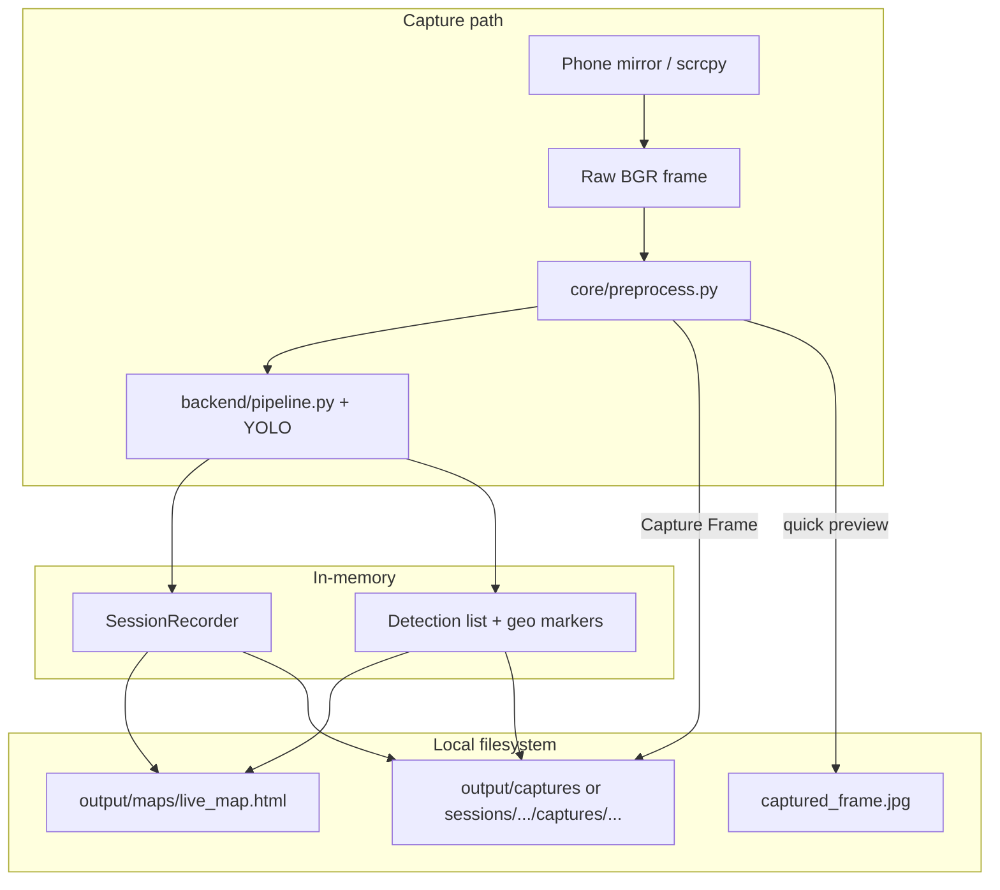
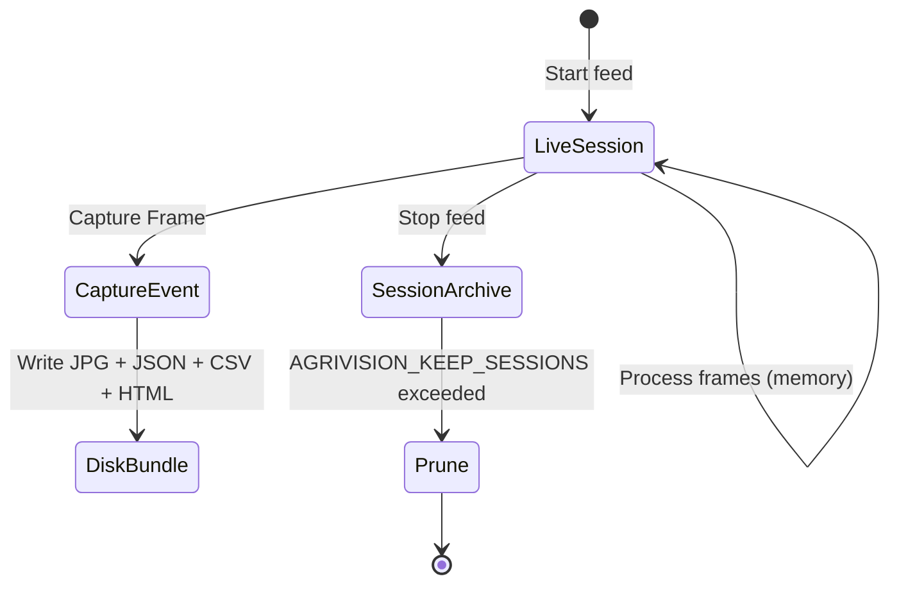

# AgriVision — Local Filesystem Storage Design

**System:** Drone-Based Banana Disease Detection and Crop Stress Mapping  
**Scope:** On-disk layout for processed images, inference outputs, maps, and reports  
**Status:** Design specification (current implementation + planned next phase)

---

## 1. Goals

| Goal | Rationale |
|------|-----------|
| **Predictable paths** | Operators and thesis reviewers can find exports without searching the repo root |
| **Session grouping** | One live run (Start → Stop) maps to one folder with related captures |
| **Artifact traceability** | JSON manifest links frame, detections, geo, and derived files |
| **Git-safe defaults** | Large binaries stay under `output/` (ignored or selectively committed) |
| **Forward-compatible** | Room for batch flights, GeoTIFF, PDF, and EXIF GPS without renaming everything |

AgriVision has **no SQL database** at runtime. The filesystem is the persistence layer for exports; live stats live in memory (`SessionRecorder`).

---

## 2. Root layout

All runtime artifacts live under a single configurable root (default: project `output/`).

```
AgriVision/
├── captured_frame.jpg          # legacy quick-preview (overwritten each Capture Frame)
├── models/
│   └── best.pt                 # deployed YOLO weights (not under output/)
├── datasets/                   # offline training data (separate domain)
├── runs/detect/                # Ultralytics training runs (separate domain)
└── output/                     # ← primary storage root (AGRIVISION_OUTPUT_ROOT)
    ├── sessions/               # one folder per live processing session
    ├── captures/               # flat fallback / quick exports (current default)
    ├── maps/                   # rolling UI maps (live session)
    ├── cache/                  # optional intermediates (preprocessed tiles, thumbnails)
    ├── batch/                  # planned: offline flight folders
    └── _smoke_test/            # automated test artifacts (disposable)
```

### Environment variables

| Variable | Default | Purpose |
|----------|---------|---------|
| `AGRIVISION_OUTPUT_ROOT` | `output` | Top-level directory for all exports |
| `AGRIVISION_REPORTS_DIR` | `{root}/captures` | Target for `export_field_report()` |
| `AGRIVISION_SESSIONS_DIR` | `{root}/sessions` | Session-scoped capture trees |
| `AGRIVISION_MAPS_DIR` | `{root}/maps` | Live Leaflet HTML |
| `AGRIVISION_CACHE_DIR` | `{root}/cache` | Ephemeral preprocess / stress tiles |
| `AGRIVISION_KEEP_SESSIONS` | `30` | Max session folders before pruning (planned) |

Paths resolve relative to the **project root** (where `main.py` lives), not the current working directory.

---

## 3. Directory roles

### 3.1 `output/sessions/` — session-scoped storage (recommended)

Each **live session** (mirror Start → Stop) gets a unique folder. Captures during that session write here instead of a flat `captures/` list.

```
output/sessions/
└── 20260622_143052_a1b2/           # {UTC date}_{time}_{short id}
    ├── session.json                # SessionRecorder snapshot + metadata
    ├── maps/
    │   └── live_map.html           # last map for this session (optional copy)
    └── captures/
        ├── 20260622_143105/        # one Capture Frame event
        │   ├── manifest.json       # same schema as report JSON (canonical)
        │   ├── frame_raw.jpg       # optional: mirror before preprocess
        │   ├── frame.jpg           # preprocessed BGR (current export)
        │   ├── frame_annotated.jpg # optional: boxes drawn (planned)
        │   ├── stress.png          # ExG heatmap (planned)
        │   ├── report.csv
        │   ├── map.html
        │   └── artifacts.json      # relative paths + checksums (planned)
        └── 20260622_143412/
            └── ...
```

**Session folder naming**

```
{YYYYMMDD}_{HHMMSS}_{session_id}
```

- `session_id`: 4-character hex or UUID fragment from `SessionRecorder` (planned).
- Created when the operator starts the live feed; closed on Stop or app exit.

**Capture subfolder naming**

```
{YYYYMMDD}_{HHMMSS}
```

Matches the existing `agrivision_{stamp}` convention but uses a directory per capture so all siblings share one prefix-free folder name.

### 3.2 `output/captures/` — flat exports (current behavior)

Today `export_field_report()` defaults to `output/reports` in code comments and `output/captures` in this design; the **implemented default** is:

```python
out_dir: str | Path = "output/reports"   # backend/report.py
```

**Current artifact set per capture** (single directory, shared timestamp prefix):

| File | Description | Producer |
|------|-------------|----------|
| `agrivision_{stamp}_frame.jpg` | Preprocessed BGR frame | `export_field_report()` |
| `agrivision_{stamp}_report.json` | Full payload: geo, detections, session | `export_field_report()` |
| `agrivision_{stamp}_report.csv` | Summary + detection table | `export_field_report()` |
| `agrivision_{stamp}_map.html` | Standalone Leaflet map | `backend/map_export.py` |

**Migration note:** Rename `output/reports/` → `output/captures/` when centralizing paths; keep reading old folder for backward compatibility for one release.

### 3.3 `output/maps/` — live UI map

| File | Writer | Update frequency |
|------|--------|------------------|
| `live_map.html` | `ui/main_window.py` → `write_map_html()` | Every geo marker refresh during live run |

This file is **overwritten** continuously; it is not a historical archive. Session copies (if enabled) go under `sessions/.../maps/`.

### 3.4 `output/cache/` — ephemeral intermediates (planned)

| Subpath | Content | TTL |
|---------|---------|-----|
| `cache/preprocess/{session_id}/` | Last N aligned frames for ECC warm-up | Session end |
| `cache/stress/{session_id}.png` | Latest ExG tile for sidebar | Session end |
| `cache/thumbs/` | Downscaled infer frames | 24 h |

Never referenced by published reports; safe to delete entirely.

### 3.5 `output/batch/` — offline flight processing (planned)

For folder drops of DJI imagery or exported flight cards:

```
output/batch/
└── flight_2026-06-22_compostela/
    ├── source/                 # symlink or copy of input images
    ├── manifest.json           # flight metadata, EXIF GPS bounds
    ├── ortho/                  # optional mosaic
    ├── tiles/                  # map tiles / GeoTIFF (planned)
    ├── detections.jsonl        # one JSON line per image
    └── report/
        ├── summary.json
        ├── summary.csv
        ├── field_map.html
        └── farmer_report.pdf     # planned
```

### 3.6 `output/_smoke_test/` — CI / dev only

Disposable artifacts from `smoke_test.py`. Safe to `.gitignore` and delete at any time.

---

## 4. Data flow



**Live path:** frames are processed in memory; only the rolling map and optional cache touch disk.

**Capture Frame path:** one atomic export bundle per button press (frame + JSON + CSV + HTML).

---

## 5. Manifest / JSON schema

The report JSON written today (`*_report.json`) is the **canonical manifest** for a capture. Recommended stable fields:

```json
{
  "system": "AgriVision",
  "exported_at": "2026-06-22T14:31:05",
  "video_source": "android",
  "geo": {
    "latitude": 7.3669,
    "longitude": 125.91,
    "altitude_m": null,
    "source": "sidebar"
  },
  "detection_summary": {
    "total": 12,
    "healthy": 8,
    "stressed": 2,
    "diseased": 2
  },
  "detections": [],
  "session": {
    "started_at": "2026-06-22T14:30:52+00:00",
    "frames_processed": 420,
    "frames_analyzed": 18,
    "peak_detections": 14
  },
  "artifacts": {
    "frame": "output/captures/agrivision_20260622_143105_frame.jpg",
    "report_json": "output/captures/agrivision_20260622_143105_report.json",
    "leaflet_map": "output/captures/agrivision_20260622_143105_map.html"
  }
}
```

**Planned extensions** in `artifacts`:

| Key | Type | Phase |
|-----|------|-------|
| `frame_raw` | JPEG | Session layout |
| `frame_annotated` | JPEG | UI overlay export |
| `stress_png` | PNG | ExG heatmap |
| `geotiff` | GeoTIFF | Batch / GPS phase |
| `farmer_pdf` | PDF | Report phase |

Use **forward slashes** in stored paths for cross-platform manifests.

---

## 6. Image and output types

| Artifact | Format | Color space | Typical size | Retention |
|----------|--------|-------------|--------------|-----------|
| Raw mirror frame | JPEG | BGR | 0.5–4 MB | Optional per capture |
| Preprocessed frame | JPEG | BGR | Same | Permanent (capture bundle) |
| Annotated frame | JPEG | BGR + overlays | Same | Optional |
| Stress map | PNG | Pseudocolor (JET) | 200 KB–2 MB | With capture |
| Leaflet map | HTML | — | 5–20 KB | With capture |
| Detection report | JSON | UTF-8 | 10–500 KB | With capture |
| Tabular summary | CSV | UTF-8 | 1–50 KB | With capture |
| Live map | HTML | — | 5–20 KB | Overwritten |
| Model weights | `.pt` | — | 6–50 MB | `models/` (versioned manually) |

**Naming convention (flat captures):**

```
agrivision_{YYYYMMDD}_{HHMMSS}_{role}.{ext}
```

Roles: `frame`, `report` (json/csv), `map`, `stress`, `annotated`.

---

## 7. Code mapping (current → target)

| Concern | Current module | Path today | Target |
|---------|----------------|------------|--------|
| Field export | `backend/report.py` | `output/reports/` | `output/captures/` or session capture dir |
| Live map | `ui/main_window.py` | `output/maps/live_map.html` | unchanged |
| Quick preview | `ui/main_window.py` | `captured_frame.jpg` (repo root) | `output/cache/last_capture.jpg` |
| Session stats | `backend/session.py` | in-memory only | `sessions/.../session.json` on stop |
| Smoke tests | `smoke_test.py` | `output/_smoke_test/` | unchanged |
| Training | `train.py` | `runs/detect/`, `models/best.pt` | out of `output/` tree |

### Suggested `StoragePaths` helper (planned)

Centralize path resolution in one module (e.g. `backend/storage.py`):

```python
@dataclass(frozen=True)
class StoragePaths:
    root: Path
    captures: Path
    sessions: Path
    maps: Path
    cache: Path

    @classmethod
    def from_env(cls) -> "StoragePaths":
        root = Path(os.environ.get("AGRIVISION_OUTPUT_ROOT", "output"))
        return cls(
            root=root,
            captures=Path(os.environ.get("AGRIVISION_REPORTS_DIR", root / "captures")),
            sessions=Path(os.environ.get("AGRIVISION_SESSIONS_DIR", root / "sessions")),
            maps=Path(os.environ.get("AGRIVISION_MAPS_DIR", root / "maps")),
            cache=Path(os.environ.get("AGRIVISION_CACHE_DIR", root / "cache")),
        )

    def ensure(self) -> None:
        for p in (self.captures, self.sessions, self.maps, self.cache):
            p.mkdir(parents=True, exist_ok=True)
```

`export_field_report()` would accept `out_dir: Path | None` and default to `StoragePaths.from_env().captures`.

---

## 8. Lifecycle and retention



| Policy | Recommendation |
|--------|----------------|
| Live map | Overwrite; no history |
| Capture bundles | Keep until manual delete or prune job |
| Sessions | FIFO prune by count (default 30) |
| Cache | Delete on session end or app start |
| Smoke test | Delete freely |
| Batch flights | Keep per thesis / field season |

**Git:** Add to `.gitignore`:

```
output/sessions/
output/captures/
output/cache/
output/maps/live_map.html
captured_frame.jpg
output/_smoke_test/
```

Keep `docs/` and small fixture JSON if needed for reproducible demos.

---

## 9. Concurrency and integrity

- **Single writer:** PyQt main thread performs Capture Frame; no parallel writes to the same stamp.
- **Atomic publish:** Write to `{name}.tmp` then rename to final name for JSON/HTML (planned hardening).
- **No file locking** required for desktop single-user use.
- **Manifest first:** Write `report.json` last so partial bundles are detectable (missing `artifacts` block).

---

## 10. Security and privacy

- Exports may contain **GPS coordinates** of plantations; treat `output/` as sensitive if deployed in the field.
- HTML maps load Leaflet from CDN; offline/air-gapped installs should vendor Leaflet under `output/maps/assets/` (future).
- Do not store mirror credentials or API keys under `output/`.

---

## 11. Implementation phases

| Phase | Deliverable | Aligns with |
|-------|-------------|-------------|
| **A (now)** | Flat `agrivision_*` bundles via `export_field_report()` | Outline defense demo |
| **B** | `StoragePaths` + env vars; move `captured_frame.jpg` under cache | Backend 50% → 60% |
| **C** | Session folders + `session.json` on stop | Session tracking |
| **D** | `stress.png`, annotated frame in bundle | Objective 2/3 exports |
| **E** | `output/batch/` + EXIF GPS + GeoTIFF | Backend remaining 50% |
| **F** | PDF farmer report + prune job | Objective 4 completion |

---

## 12. Panel Q&A (short answers)

1. **Why no database?** Outline milestone uses flat files farmers can open in Excel, a browser, or any JSON viewer.
2. **Where is the live feed stored?** It is not archived by default—only explicit Capture Frame writes disk.
3. **How do you find one field visit?** By timestamp in filename or future `sessions/{date}/` folder.
4. **What about training data?** Separate tree under `datasets/`; not mixed with runtime `output/`.

---

## 13. Related documents

- [OUTLINE_DEFENSE_STATUS.md](OUTLINE_DEFENSE_STATUS.md) — demo script and completion percentages  
- [ERD.md](ERD.md) — logical entities (`FIELD_REPORT`, `REPORT_ARTIFACT`)  
- [CONCEPTUAL_FRAMEWORK.md](CONCEPTUAL_FRAMEWORK.md) — DFD and use cases  
