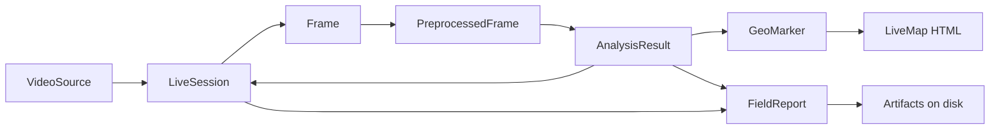

# AgriVision — Workflow ERD (JSON Schema)

Simple view of how data moves through the system. **No database** — objects live in memory during a live run; `FieldReport` is written to disk on **Capture Frame**.

**Draw.io:** Open [`diagrams/AgriVision-Workflow-ERD.drawio`](diagrams/AgriVision-Workflow-ERD.drawio) in [diagrams.net](https://app.diagrams.net/) → **File → Export as → PNG (300 DPI)** for thesis slides.

---

## Workflow



| Step | Module | Stored? |
|------|--------|---------|
| Mirror feed | `utils/cast_manager.py` | No |
| Session stats | `backend/session.py` | Memory |
| Preprocess + YOLO | `backend/pipeline.py` | Memory |
| Geo markers | `backend/geo.py` | Memory → map HTML |
| Export | `backend/report.py` | `output/reports/` |

---

## Entity relationships

```
VideoSource (1) ──starts──▶ LiveSession (1)
LiveSession (1) ──processes many──▶ Frame (N)
Frame (1) ──preprocess──▶ PreprocessedFrame (1)
PreprocessedFrame (1) ──detect──▶ AnalysisResult (1)
AnalysisResult (1) ──contains──▶ Detection (N)
AnalysisResult (1) ──has──▶ HealthSummary (1)
GeoTag (1) + Detection (N) ──maps to──▶ GeoMarker (N)
Capture Frame ──writes──▶ FieldReport (1) ──links──▶ Artifacts (files)
```

---

## JSON Schemas

Draft 2020-12 style. `$id` values are logical names only (not live URLs).

### Shared definitions

```json
{
  "$schema": "https://json-schema.org/draft/2020-12/schema",
  "$id": "agrivision/common.json",
  "$defs": {
    "HealthSummary": {
      "type": "object",
      "properties": {
        "total": { "type": "integer", "minimum": 0 },
        "healthy": { "type": "integer", "minimum": 0 },
        "stressed": { "type": "integer", "minimum": 0 },
        "diseased": { "type": "integer", "minimum": 0 }
      },
      "required": ["total", "healthy", "stressed", "diseased"]
    },
    "GeoTag": {
      "type": "object",
      "properties": {
        "latitude": { "type": "number" },
        "longitude": { "type": "number" },
        "altitude_m": { "type": ["number", "null"] },
        "source": { "type": "string", "examples": ["manual", "browser_gps", "default"] }
      },
      "required": ["latitude", "longitude", "source"]
    },
    "Detection": {
      "type": "object",
      "properties": {
        "bbox": {
          "type": "array",
          "items": { "type": "integer" },
          "minItems": 4,
          "maxItems": 4,
          "description": "[x1, y1, x2, y2] pixels"
        },
        "label": { "type": "string", "examples": ["Healthy (0.92)"] },
        "confidence": { "type": "number", "minimum": 0, "maximum": 1 },
        "class": { "type": "integer", "description": "YOLO class id" }
      },
      "required": ["bbox", "label", "confidence", "class"]
    },
    "GeoMarker": {
      "type": "object",
      "properties": {
        "lat": { "type": "number" },
        "lon": { "type": "number" },
        "label": { "type": "string" },
        "category": { "type": "string", "enum": ["healthy", "stressed", "diseased"] },
        "confidence": { "type": "number" }
      },
      "required": ["lat", "lon", "label", "category"]
    }
  }
}
```

### 1. VideoSource — operator mirror settings

```json
{
  "$schema": "https://json-schema.org/draft/2020-12/schema",
  "$id": "agrivision/VideoSource.json",
  "title": "VideoSource",
  "type": "object",
  "properties": {
    "platform": { "type": "string", "enum": ["android", "ios"] },
    "device_ip": { "type": "string" },
    "quality": { "type": "string" },
    "window_title": { "type": "string" }
  },
  "required": ["platform"]
}
```

### 2. LiveSession — rolling run stats (memory)

```json
{
  "$schema": "https://json-schema.org/draft/2020-12/schema",
  "$id": "agrivision/LiveSession.json",
  "title": "LiveSession",
  "type": "object",
  "properties": {
    "started_at": { "type": "string", "format": "date-time" },
    "frames_processed": { "type": "integer" },
    "frames_analyzed": { "type": "integer" },
    "total_detections": { "type": "integer" },
    "peak_detections": { "type": "integer" },
    "last_detection_summary": { "$ref": "common.json#/$defs/HealthSummary" },
    "geo_marker_count": { "type": "integer" },
    "last_geo": { "$ref": "common.json#/$defs/GeoTag" }
  },
  "required": ["started_at", "frames_processed", "frames_analyzed"]
}
```

### 3. AnalysisResult — one frame through the pipeline (memory)

```json
{
  "$schema": "https://json-schema.org/draft/2020-12/schema",
  "$id": "agrivision/AnalysisResult.json",
  "title": "AnalysisResult",
  "type": "object",
  "properties": {
    "frame_shape": {
      "type": "array",
      "items": { "type": "integer" },
      "minItems": 2,
      "maxItems": 2,
      "description": "[height, width]"
    },
    "detections": {
      "type": "array",
      "items": { "$ref": "common.json#/$defs/Detection" }
    },
    "detection_summary": { "$ref": "common.json#/$defs/HealthSummary" },
    "classification": { "type": "object", "description": "Optional full-frame classifier output" }
  },
  "required": ["detections", "detection_summary", "frame_shape"]
}
```

### 4. FieldReport — persisted export (disk)

Root document written by `export_field_report()`. Embeds session, geo, detections, and file paths.

```json
{
  "$schema": "https://json-schema.org/draft/2020-12/schema",
  "$id": "agrivision/FieldReport.json",
  "title": "FieldReport",
  "type": "object",
  "properties": {
    "system": { "const": "AgriVision" },
    "exported_at": { "type": "string", "format": "date-time" },
    "video_source": { "type": "string" },
    "geo": { "$ref": "common.json#/$defs/GeoTag" },
    "detection_summary": { "$ref": "common.json#/$defs/HealthSummary" },
    "detections": {
      "type": "array",
      "items": { "$ref": "common.json#/$defs/Detection" }
    },
    "session": { "$ref": "LiveSession.json" },
    "artifacts": {
      "type": "object",
      "properties": {
        "frame": { "type": "string", "description": "Path to JPEG" },
        "report_json": { "type": "string" },
        "leaflet_map": { "type": "string", "description": "Path to HTML map" }
      }
    }
  },
  "required": ["system", "exported_at", "geo", "detection_summary", "detections", "artifacts"]
}
```

**Example** (from smoke test):

```json
{
  "system": "AgriVision",
  "exported_at": "2026-06-22T22:39:42",
  "video_source": "android",
  "geo": { "latitude": 7.3669, "longitude": 125.91, "altitude_m": null, "source": "manual" },
  "detection_summary": { "total": 1, "healthy": 1, "stressed": 0, "diseased": 0 },
  "detections": [
    { "bbox": [10, 10, 50, 50], "label": "Healthy (0.9)", "confidence": 0.9, "class": 0 }
  ],
  "session": { "started_at": "2026-06-22T14:30:52+00:00", "frames_processed": 420 },
  "artifacts": {
    "frame": "output/reports/agrivision_20260622_223942_frame.jpg",
    "report_json": "output/reports/agrivision_20260622_223942_report.json",
    "leaflet_map": "output/reports/agrivision_20260622_223942_map.html"
  }
}
```

---

## One-line pipeline (defense)

> **VideoSource** configures the mirror → **LiveSession** counts frames → each **Frame** is preprocessed and analyzed into **AnalysisResult** (detections + health summary) → **GeoTag** + detections become **GeoMarker**s on the map → **Capture Frame** flattens everything into a **FieldReport** JSON plus JPG/CSV/HTML files.

---

## Related

- [ERD.md](ERD.md) — full conceptual ERD (Mermaid + draw.io)
- [STORAGE_DESIGN.md](STORAGE_DESIGN.md) — where `FieldReport` artifacts are stored
- [OUTLINE_DEFENSE_STATUS.md](OUTLINE_DEFENSE_STATUS.md) — completion checklist
